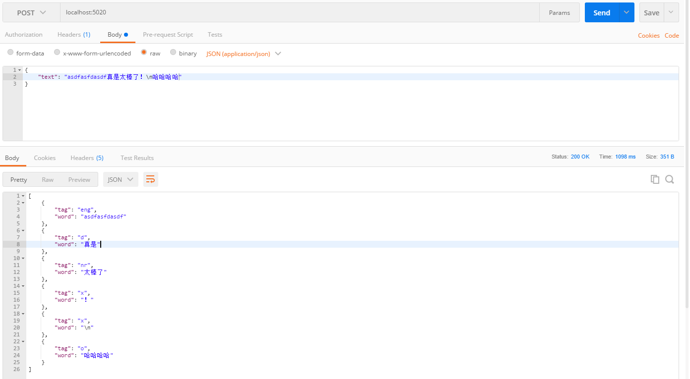

# 使用
因为一直在windows上用不了，所以直接使用dockerfile来创建环境，在环境中进行npm install安装依赖之后，使用命令
```bash
node server.js
```
启动项目，默认端口号5020

# 接口格式
POST请求，Content-Type为application/json
接收一个text参数，把文章通过这个字段传入即可


# 应用示例demo
[使用分词制作wps审校插件](http://note.youdao.com/noteshare?id=c89b2363925a9dd948f2247626a9c323&sub=8A015324F6D44E57B82B021C3DBC86E0)
[Github地址](https://github.com/flashtd1/wps-reviewer-addon)